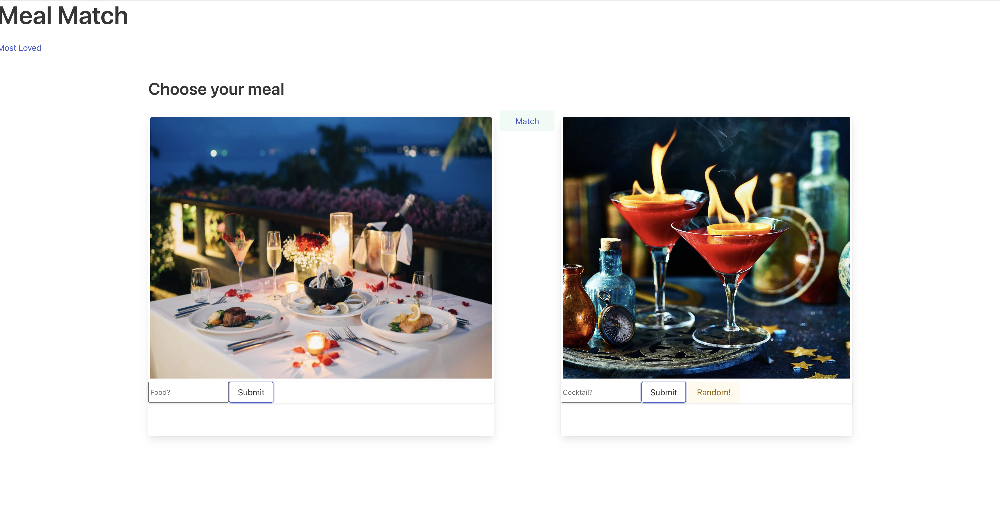
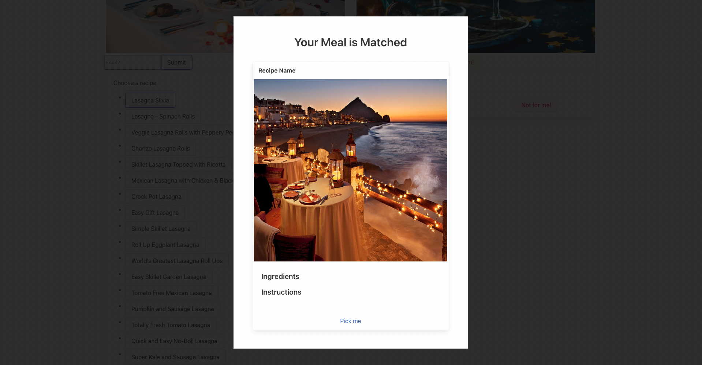
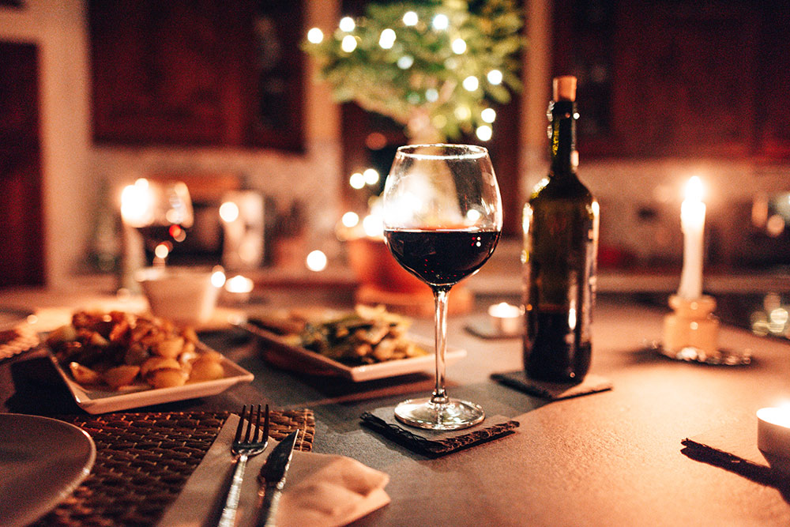

# <Meal Match>

## Description

As a user i would like to have the best selection of meal with cocktail. So i can have the best dining at home experience.

- GIVEN: I am choosing what i want to eat and drink for any meal
- WHEN: I search a recipe in the "recipe" box
- THEN: a list of potential recipes will appear below it
- WHEN: I search a drink in the "cocktail" box
- THEN: a list of potential cocktail drinks will appear below it
- WHEN: I select a recipe a pop up will show a preview
- THEN: i will select or close
- WHEN: I select a cocktail a pop up will show a preview
- THEN: i will select or close
- WHEN: I have selected both recipes
- THEN: they will appear on the screen to accept or reject
- WHEN: Accepted
- THEN: they will save to local storage history and a 2nd page will open to fully display the recipes that were chosen
- WHEN: I click the heart at the top of the page
- THEN: i see a history of what i have made in the past and if it was a good match or not

Provide a short description explaining the what, why, and how of your project. Use the following questions as a guide:

- What was your motivation?
  Various motivation factors are responsible for choices of foods and beverages in different eating occasions at various times of the day. The study of food and people’s perception of flavors has proven to be very marketable throughout the casual dining sector.
- Why did you build this project?
  The recipe is essential. Skill… I don’t think skill is as important as the recipe because the more you do it, the better you get. But what I think really is important – is the way you do it.
- What problem does it solve?
  Standardized recipes help ensure that the best possible food items are produced every time. ingredients and quantities are used each time the recipe is prepared, the cost per serving remains the same. of ingredients needed for production can be easily calculated based on the information provided on the recipe.

## Usage

## Credits

- Liane Ricciardo
- Imran Rasi
- Kevyn Dobson
- Luis Romero

## License

MIT License

Copyright (c) 2022 ricky-rosay

Permission is hereby granted, free of charge, to any person obtaining a copy
of this software and associated documentation files (the "Software"), to deal
in the Software without restriction, including without limitation the rights
to use, copy, modify, merge, publish, distribute, sublicense, and/or sell
copies of the Software, and to permit persons to whom the Software is
furnished to do so, subject to the following conditions:

The above copyright notice and this permission notice shall be included in all
copies or substantial portions of the Software.

THE SOFTWARE IS PROVIDED "AS IS", WITHOUT WARRANTY OF ANY KIND, EXPRESS OR
IMPLIED, INCLUDING BUT NOT LIMITED TO THE WARRANTIES OF MERCHANTABILITY,
FITNESS FOR A PARTICULAR PURPOSE AND NONINFRINGEMENT. IN NO EVENT SHALL THE
AUTHORS OR COPYRIGHT HOLDERS BE LIABLE FOR ANY CLAIM, DAMAGES OR OTHER
LIABILITY, WHETHER IN AN ACTION OF CONTRACT, TORT OR OTHERWISE, ARISING FROM,
OUT OF OR IN CONNECTION WITH THE SOFTWARE OR THE USE OR OTHER DEALINGS IN THE
SOFTWARE.
